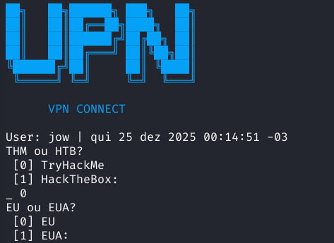

# VPN Connect
Este script tem como objetivo **facilitar a conexão VPN** em ambientes de estudo, labs e CTFs,
como **TryHackMe** e **Hack The Box**.

Ele pode ser adaptado para qualquer laboratório ou VPN, respeitando sempre a **licença aplicada**
ao serviço utilizado.


## Pré-requisitos:
- `openvpn`

- `bash` (ou shell compatível)

- `sudo` (ou root)

- `git`
## Configurando e instalando:   

```BASH
git clone https://github.com/H3XSILENT/VPN_CONNECT.git
cd VPN_CONNECT;chmod +x install.sh;
./install.sh
```

Rode o script: 
```BASH
$ vpn
```
### Capturas de tela:


